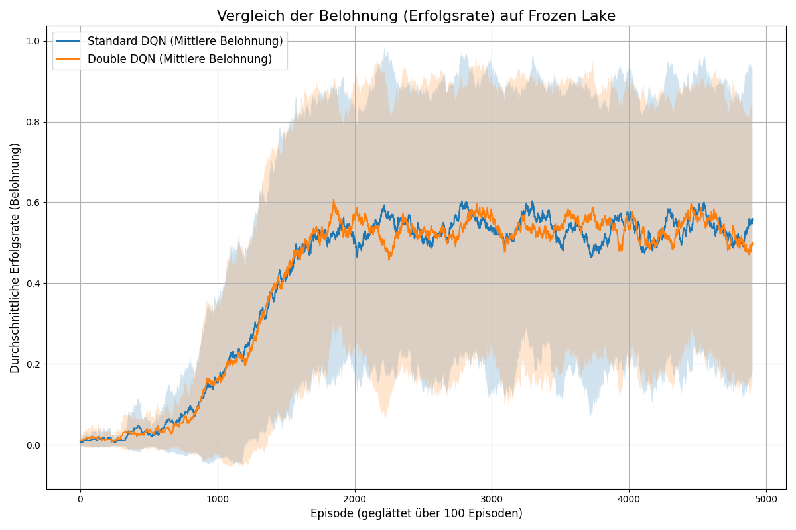
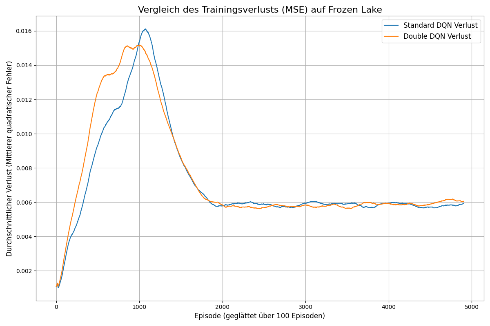

# DQN und Double DQN auf FrozenLake

Dieses Repository enthält ein Jupyter Notebook (hands-on.ipynb), das zwei Reinforcement-Learning-Algorithmen implementiert und vergleicht: Deep Q-Network (DQN) und Double Deep Q-Network (DDQN). Die Algorithmen werden in der FrozenLake-v1-Umgebung aus der Gymnasium-Bibliothek trainiert und ausgewertet.

## Inhalte des Notebooks

- Implementierung eines DQN-Agenten: Ein Agent, der mit einem Deep Q-Network (erstellt mit PyTorch) lernt, die optimale Policy zu finden.
- Implementierung eines Double-DQN-Agenten: Eine verbesserte Variante des DQN, die das Problem der Überschätzung der Q-Werte (Overestimation Bias) reduziert.
- Training in FrozenLake-v1: Beide Agenten werden in der stochastischen (is_slippery=True) Version der FrozenLake-Umgebung trainiert.
- Leistungsvergleich: Die durchschnittliche Erfolgsrate (Belohnung) und der Trainingsverlust (MSE) beider Agenten werden über mehrere Trainingsdurchläufe verglichen.
- Visualisierung: Die Ergebnisse werden mit Matplotlib visualisiert und als PNG-Dateien gespeichert.

## Setup und Installation

Um das Notebook auszuführen, wird empfohlen, eine virtuelle Umgebung zu verwenden. Alle notwendigen Pakete sind in der requirements.txt-Datei aufgeführt. Installieren Sie sie mit folgendem Befehl:

```bash
pip install -r requirements.txt
```

## Ergebnisse

Das Notebook erzeugt zwei Diagramme, die die Leistung der beiden Agenten vergleichen:
Vergleich der Erfolgsrate (Belohnung): Zeigt die geglättete durchschnittliche Belohnung pro Episode für DQN und DDQN.


Vergleich des Trainingsverlusts: Stellt den geglätteten durchschnittlichen Mean Squared Error (MSE) während des Trainings dar.

